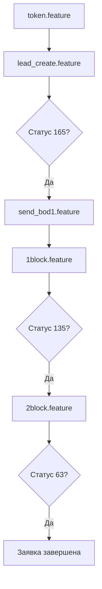

# Руководство для новичка: backend-automation

> Для тестировщика без опыта в автоматизации.  
> Объяснение максимально простое — как для человека, который только начинает.

---

## Содержание

1. [Что это за проект](#1-что-это-за-проект)
2. [Базовые понятия](#2-базовые-понятия)
3. [Структура проекта](#3-структура-проекта)
4. [Установка и запуск](#4-установка-и-запуск)
5. [Как устроены тесты](#5-как-устроены-тесты)
6. [Ключевые файлы](#6-ключевые-файлы)
7. [Все тесты по порядку](#7-все-тесты-по-порядку)
8. [Статусы заявки](#8-статусы-заявки)
9. [Полная цепочка запуска](#9-полная-цепочка-запуска)
10. [Как читать логи](#10-как-читать-логи)
11. [Частые вопросы](#11-частые-вопросы)
12. [Шпаргалка по шагам](#12-шпаргалка-по-шагам)

---

## 1. Что это за проект

Это **автоматические тесты** для банковского сервиса **HCA** (оформление кредитов агентом).

Компьютер сам:
- отправляет запросы на сервер (API);
- проверяет ответы;
- ждёт, пока заявка сменит статус.

Ты **не нажимаешь кнопки в приложении** — тесты делают то же самое через HTTP-запросы.

### Что проверяем

Полный путь кредитной заявки:

```
Токен → OTP → Создание лида → Ожидание PST → Оффер → 1 блок → 2 блок → Подписание
```

### Два продукта

| Продукт | Папка | Описание |
|---------|-------|----------|
| **Xsell (Cash)** | `features/PST/Xsell[Real]/` | Обычный кредит наличными |
| **Refinance** | `features/PST/Refinance/` | Рефинансирование (перекредитование) |

---

## 2. Базовые понятия

### Бэкенд

**Фронт** — приложение на телефоне (то, что видишь).  
**Бэкенд** — сервер «за кулисами»: принимает запросы, считает кредит, сохраняет заявку.

### API

**API** — набор адресов (URL), куда можно отправить запрос.

| Метод | Значение | Аналогия |
|-------|----------|----------|
| **GET** | «Дай мне данные» | Спросить |
| **POST** | «Сделай что-то / прими данные» | Заполнить форму и отправить |

Примеры из проекта:

```
GET  /agent-api/v1/open/users/user/980516301284   → данные агента
POST /agent-api/v2/lead-management/create       → создать заявку
```

### Автоматизация vs ручное тестирование

| Ручной тест | Автотест |
|-------------|----------|
| Ты сам заходишь в приложение | Компьютер шлёт запросы |
| Долго, можно ошибиться | Быстро, одинаково каждый раз |
| Устаёшь повторять | Можно гонять хоть 100 раз |

### Behave и `.feature` файлы

Используем **BDD** — тесты пишутся почти на русском:

```gherkin
Feature: Создание лида

  Scenario: Отправка сообщения PERSONALIZED_CONSENT
    When я отправляю POST запрос на "/agent-api/v2/lead-management/create" и токеном
    Then статус ответа 200
```

| Слово | Значение |
|-------|----------|
| **Feature** | Большая тема теста |
| **Scenario** | Один конкретный сценарий |
| **When** | Действие («когда я делаю X») |
| **Then** | Проверка («тогда должно быть Y») |
| **And** | Ещё один шаг того же типа |

**Behave** читает `.feature`, находит Python-код в `api_steps.py` и выполняет.

### Python в этом проекте

Python — язык «логики» тестов:
- отправить HTTP-запрос;
- проверить JSON-ответ;
- подождать нужный статус заявки.

### JSON

Ответ сервера приходит в формате **JSON** — структурированный текст:

```json
{
  "id": 12345,
  "leadDTO": {
    "nin": "990525301374",
    "stateFeature": {
      "id": 165
    }
  }
}
```

Путь `leadDTO.stateFeature.id` = зайти в `leadDTO` → потом в `stateFeature` → взять `id`.

### Токен

**Токен** — пропуск на сервер. Без него запросы с данными заявки не пройдут.

Получаем один раз → сохраняем в `token.txt` → все тесты его используют.

---

## 3. Структура проекта

```
backend-automation/
├── doc/
│   ├── windows_install.md       # Установка на Windows
│   ├── mac_install.md           # Установка на macOS
│   └── guide_for_beginners.md   # Это руководство
├── features/
│   ├── environment.py           # Настройка перед запуском всех тестов
│   ├── steps/
│   │   └── api_steps.py         # Python-код для каждого шага (When/Then)
│   ├── resources/               # Фото для загрузки (удостоверение, селфи)
│   ├── token.feature            # Тест: получение токена
│   ├── get_user.feature         # Тест: данные агента по ИИН
│   └── PST/
│       ├── Xsell[Real]/         # Сценарии обычного кредита
│       │   ├── lead_create.feature
│       │   ├── send_bod1.feature
│       │   ├── 1block.feature
│       │   └── 2block.feature
│       └── Refinance/           # Сценарии рефинанса
│           ├── rf_lead_create.feature
│           └── rf_send_bod1.feature
├── utils/
│   └── api_client.py            # Отправка HTTP-запросов
├── token.txt                    # Сохранённый токен (генерируется тестом)
├── requirements.txt             # Зависимости Python
└── README.md
```

---

## 4. Установка и запуск

Подробнее: [windows_install.md](windows_install.md) | [mac_install.md](mac_install.md)

### Windows — кратко

```powershell
# 1. Python 3.12+ с галочкой "Add Python to PATH"
python --version

# 2. В корне проекта
python -m venv .venv
.venv\Scripts\activate
pip install -r requirements.txt

# 3. Запуск
behave features/token.feature
behave features/PST/Xsell[Real]/lead_create.feature
behave   # все тесты
```

### Виртуальное окружение `.venv`

Отдельная «коробка» с Python и библиотеками только для этого проекта.  
После `activate` команды `python` и `pip` работают из `.venv`.

### Зависимости (`requirements.txt`)

| Пакет | Зачем |
|-------|-------|
| `behave` | Запуск `.feature` тестов |
| `requests` | HTTP-запросы к API |

---

## 5. Как устроены тесты

### Схема работы

```
┌─────────────────┐     ┌──────────────────┐     ┌─────────────────┐
│  .feature файл  │ ──► │   api_steps.py   │ ──► │  Сервер (API)   │
│  (русский текст)│     │  (Python-код)    │     │  dev-agent...   │
└─────────────────┘     └──────────────────┘     └─────────────────┘
```

1. Behave читает шаг `When я отправляю GET запрос...`
2. Ищет функцию с таким же текстом в `api_steps.py`
3. Функция вызывает `api_client` → запрос на сервер
4. Шаг `Then статус ответа 200` проверяет результат

### Хранилища данных в памяти

В `api_steps.py` есть два словаря:

```python
endpoint_response_map = {}  # Полные ответы API по endpoint
field_value_map = {}        # Сохранённые значения: id, key, offerId...
```

**Зачем:** шаг 1 создаёт лид и получает `id`. Шаг 5 подставляет этот `id` в URL. Без хранилища значение потерялось бы.

### Подстановка `{{{key}}}`

В `.feature` можно писать:

```gherkin
When я отправляю GET запрос на "/agent-api/v1/lead-management/get-details/{{{id}}}" с токеном
```

Python заменит `{{{id}}}` на реальное значение из `field_value_map`.

В POST-теле тоже работает:

```json
{
    "code": "1111",
    "key": "{{{key}}}"
}
```

### Тестовый сервер

Все запросы идут на:

```
https://dev-agent.homecredit.kz
```

Это **dev** (тестовая среда), не продакшн.

---

## 6. Ключевые файлы

### `features/environment.py`

Выполняется **один раз** перед всеми тестами:

```python
context.api_client = ApiClient(base_url="https://dev-agent.homecredit.kz")
```

Создаёт «клиент» для отправки запросов.

### `utils/api_client.py`

| Метод | Описание |
|-------|----------|
| `get(endpoint)` | GET без авторизации |
| `get_with_auth(endpoint)` | GET с токеном из `token.txt` |
| `post_with_auth(endpoint, payload)` | POST с токеном |
| `post_header(endpoint, headers)` | POST для получения токена |

### `features/steps/api_steps.py`

Связывает русский текст из `.feature` с Python-кодом.

Пример:

```python
@when('я отправляю GET запрос на "{endpoint}" с токеном')
def step_impl(context, endpoint):
    context.response = context.api_client.get_with_auth(endpoint)
```

### `token.txt`

Файл с токеном. Создаётся тестом `token.feature` или шагом внутри `rf_lead_create.feature`.  
**Не коммить в git** реальный токен с продакшна — для dev это рабочий файл.

---

## 7. Все тесты по порядку

### 7.1 `features/token.feature` — Получение токена

**Цель:** войти в систему и получить пропуск.

| Шаг | Что происходит |
|-----|----------------|
| `When отправляю запрос на получение токена` | POST на `/agent-auth/oauth/token` с логином/паролем агента |
| `Then статус ответа 200` | Сервер ответил OK |
| `Then ответ содержит поле "access_token"` | В ответе есть токен |

Токен сохраняется в `token.txt`.

**Запуск:**

```powershell
behave features/token.feature
```

---

### 7.2 `features/get_user.feature` — Данные агента по ИИН

**Цель:** проверить, что API отдаёт данные агента.

| Шаг | Что происходит |
|-----|----------------|
| GET `/agent-api/v1/open/users/user/980516301284` | Запрос без токена (open endpoint) |
| Статус 200 | OK |
| `user.firstName` равен `"үуГДёкЖ"` | Имя совпадает |

**Запуск:**

```powershell
behave features/get_user.feature
```

---

### 7.3 `features/PST/Xsell[Real]/lead_create.feature` — Создание лида (Xsell)

**Цель:** создать заявку клиента и дождаться обработки PST.

**Тестовые данные клиента:**

| Поле | Значение |
|------|----------|
| ИИН | `990525301374` |
| Телефон | `7074575944` |
| ФИО | КУАН АБЫЛАЙ |

**Пошагово:**

| # | Шаг | Объяснение |
|---|-----|------------|
| 1 | GET `otp/generate-save/...` | Запрос OTP-кода. Сохраняем `key` |
| 2 | POST `otp/validate-save` | Подтверждаем код `1111` (в dev всегда 1111) |
| 3 | POST `lead-management/create` | Создаём заявку. Сохраняем `id` |
| 4 | GET `get-details/{id}` | Проверяем: статус = `3`, ИИН совпадает |
| 5 | Ожидание статуса **165** | PST обработал заявку (поллинг каждые 5 сек, до 40 попыток) |

**Запуск:**

```powershell
behave "features/PST/Xsell[Real]/lead_create.feature"
```

> На Windows путь в кавычках из-за скобок `[Real]`.

---

### 7.4 `features/PST/Refinance/rf_lead_create.feature` — Создание лида (Refinance)

**То же, что `lead_create`**, но:
- в начале **сам получает токен**;
- дальше та же цепочка OTP → create → ожидание 165.

**Запуск:**

```powershell
behave features/PST/Refinance/rf_lead_create.feature
```

---

### 7.5 `features/PST/Xsell[Real]/send_bod1.feature` — Отправка на 1 блок (Cash)

**Цель:** выбрать кредитное предложение и отправить на первичное одобрение.

**Предусловие:** лид создан, статус 165, `id` есть в памяти (запускать после `lead_create` в той же сессии `behave`).

| # | Шаг | Объяснение |
|---|-----|------------|
| 1 | GET `lead-data-controller/doc/{id}` | Документы лида |
| 2 | GET `offer-store/offers/{id}` | Список кредитных предложений |
| 3 | Извлечь offerId `[CEL][Cash Xsell][Real]` | Выбрать нужный оффер |
| 4 | POST `customer-offer/calculate` | Расчёт на 200 000 тенге |
| 5 | POST `product-catalog/CEL` | Продукт `XSTUF--FFP` |
| 6 | POST `files/send-img-to-auth` | 3 фото: удостоверение + селфи |
| 7 | POST `application-management/update` | Обновить заявку с суммой и оффером |
| 8 | POST `lead-management/update` с фото | Контакты, секретный вопрос, фото |

---

### 7.6 `features/PST/Refinance/rf_send_bod1.feature` — Отправка на 1 блок (Refinance)

**Как `send_bod1`**, отличия:

| Параметр | Xsell | Refinance |
|----------|-------|-----------|
| Тип оффера | `[CEL][Cash Xsell][Real]` | `[CEL][Refinance Xsell][Real]` |
| Продукт | `XSTUF--FFP` | `XSTNF--FFP` (×3) |
| Контракты | — | Автовыбор из `refinanceContracts` |

При calculate система ищет контракт с суммой от 10 000 до 4 900 000 тенге.

---

### 7.7 `features/PST/Xsell[Real]/1block.feature` — 1 блок одобрил

**Цель:** дождаться одобрения 1 блока и отправить данные дальше.

| Шаг | Объяснение |
|-----|------------|
| Ожидание статуса **135** | 1 блок одобрил |
| POST `lead-management/update` | Доп. данные: контакты, секретный вопрос |

---

### 7.8 `features/PST/Xsell[Real]/2block.feature` — Подписание договора

**Цель:** пройти финальные шаги до подписанного договора.

| # | Шаг | Статус |
|---|-----|--------|
| 1 | Ожидание **61** | 2 блок одобрил |
| 2 | POST `disbursement-channel` | IBAN для выплаты |
| 3 | GET `prepareDocument/task/{id}` | Подготовка документа |
| 4 | POST `lead-management/update` | Обновление заявки |
| 5 | Ожидание **243** | Готово к подписи |
| 6 | POST `eds/create-sign/SIGN_CONTRACT` | Электронная подпись (селфи) |
| 7 | GET `eds/certify-sign/{id}/0000` | Подтверждение подписи |
| 8 | POST `lead-management/update` | Финальное обновление |
| 9 | Ожидание **63** | **Заявка завершена** |

---

## 8. Статусы заявки

Статус лежит в `leadDTO.stateFeature.id` (ответ `get-details`).

| Код | Значение |
|-----|----------|
| **3** | Лид только создан |
| **165** | PST обработал, можно выбирать оффер |
| **135** | 1 блок одобрил |
| **61** | 2 блок одобрил |
| **243** | Готово к подписанию |
| **63** | Договор подписан, заявка завершена |

### Как работает ожидание статуса

Тест **не ждёт молча** — он опрашивает сервер:

```
Попытка 1: статус 3   → ждём 5 сек
Попытка 2: статус 3   → ждём 5 сек
...
Попытка N: статус 165 → ✅ продолжаем
```

Если за отведённое время статус не сменился — тест падает.

---

## 9. Полная цепочка запуска

### Xsell (обычный кредит)

```
token.feature
    ↓
lead_create.feature
    ↓
send_bod1.feature
    ↓
1block.feature
    ↓
2block.feature
```

```powershell
behave "features/PST/Xsell[Real]/"
```

### Refinance

```
rf_lead_create.feature   (токен внутри)
    ↓
rf_send_bod1.feature
    ↓
1block.feature
    ↓
2block.feature
```

```powershell
behave features/PST/Refinance/
behave "features/PST/Xsell[Real]/1block.feature"
behave "features/PST/Xsell[Real]/2block.feature"
```

### Важно про порядок

`field_value_map` (сохранённый `id` лида) живёт **в рамках одного запуска `behave`**.

Если запускать файлы по отдельности — `1block` и `2block` не найдут `id`, если лид не был создан в той же сессии.

---

## 10. Как читать логи

| Символ | Значение |
|--------|----------|
| `✅` | Шаг прошёл, данные сохранены |
| `⏳` | Ждём нужный статус (нормально, может занять минуты) |
| `❌` | Ошибка, тест упадёт |
| `📤` | Что отправили на сервер |
| `📦` | Что получили в ответ |

### Типичные ошибки

| Сообщение | Причина |
|-----------|---------|
| `Ожидался статус 200, но получен 500` | Ошибка на сервере |
| `Поле 'X' не содержит 'Y'` | Ответ не совпал с ожиданием |
| `Поле id не найдено в field_value_map` | Не запускали предыдущий тест / нет id |
| Тест завис на `⏳` | Сервер ещё не сменил статус или заявка застряла |

---

## 11. Частые вопросы

**Зачем `token.txt`?**  
Токен — пропуск. Получили один раз, все запросы его используют.

**Почему OTP всегда `1111`?**  
На dev-сервере тестовый код зафиксирован.

**Что такое PST?**  
Внешняя система обработки. После создания лида она «думает» — мы ждём статус 165.

**Что такое «блок»?**  
Этап одобрения. 1 блок — первичная проверка. 2 блок — финальное одобрение перед подписанием.

**Зачем фото в base64?**  
API принимает картинки как закодированный текст. Python читает `.jpg` и превращает в длинную строку.

**Можно менять ИИН и телефон?**  
Только если клиент есть в тестовой базе и для него всё настроено.

**Что такое `behave` vs `pytest`?**  
В README упомянут pytest, но проект использует **behave** (BDD). Запускай через `behave`.

---

## 12. Шпаргалка по шагам

Текст в `.feature` → функция в `api_steps.py`:

| Шаг в feature | Что делает код |
|---------------|----------------|
| `отправляю запрос на получение токена` | Логин, сохранение в `token.txt` |
| `я отправляю GET запрос на "..." с токеном` | GET + сохранение ответа в map |
| `я отправляю POST запрос на "..." и токеном` | POST с JSON из блока под шагом |
| `беру из ответа "..." поле "..."` | Достать значение из JSON, сохранить |
| `статус ответа 200` | Проверить HTTP-код |
| `поле "..." равен "..."` | Проверить значение в ответе |
| `Ожидаю когда поле ... и статус "165"` | Поллинг `get-details` каждые 5 сек |
| `я извлекаю offerId с типом "..."` | Найти оффер в `offerDTOList` |
| `POST ... calculate ... leadId и offerId` | Расчёт кредита, сохранение кодов |
| `POST ... send-img-to-auth ... 3 фото` | Загрузка id_card_front, id_card_back, selfie |
| `POST ... application-management/update` | Обновление заявки с суммой |
| `POST ... lead-management/update с id` | Контакты, секретный вопрос |
| `POST ... disbursement-channel` | IBAN `KZ92886D224301728288` |
| `POST ... create-sign/SIGN_CONTRACT` | Электронная подпись |

---

## Диаграмма полного флоу (Xsell)



---

## С чего начать новичку

1. Установи окружение по [windows_install.md](windows_install.md)
2. Запусти `behave features/token.feature` — убедись, что токен получен
3. Запусти `behave features/get_user.feature` — простой тест на чтение
4. Открой `lead_create.feature` и `api_steps.py` рядом — читай шаг за шагом
5. Запусти полную цепочку Xsell и смотри логи в консоли

---

## Связанные документы

- [README.md](../README.md) — обзор проекта
- [windows_install.md](windows_install.md) — установка на Windows
- [mac_install.md](mac_install.md) — установка на macOS
